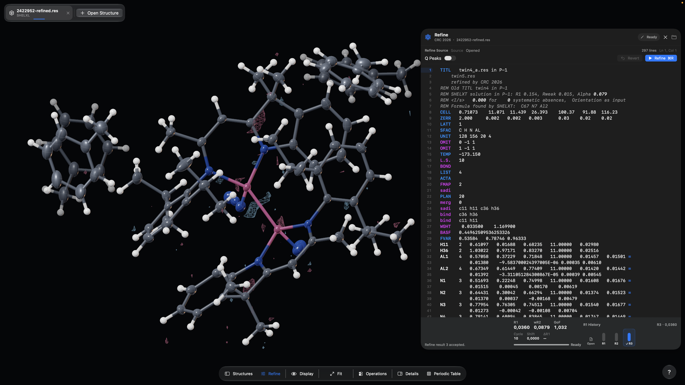

# CrystalScopeX 0.3.7

[English](README.md) | **Deutsch**

  

  <strong><a href="https://github.com/DrWXB/CrystalScopeX-Releases/releases/download/v0.3.7/CrystalScopeX-0.3.7-macOS-arm64.dmg">CrystalScopeX 0.3.7 für macOS arm64 herunterladen</a></strong>

CrystalScopeX erweckt Kristall&shy;strukturen in einer flüssigen, visuell
eindrucksvollen wissen&shy;schaftlichen Arbeits&shy;umgebung zum Leben.
Erkunden Sie vollständige kristallo&shy;graphische Modelle interaktiv in 3D,
von kleinen Molekülen über symmetrie&shy;erzeugte Komponenten, Fehlordnung und
Verzwillingung bis zu anisotropen Auslenkungs&shy;parametern. Messen,
verfeinern und gestalten Sie publikations&shy;reife Ergebnisse in
einer fokussierten Oberfläche, die Ideen voranbringt.

## Installation

Version **0.3.7 (Build 10)** ist für arm64-Systeme mit macOS 26.0 oder neuer und Metal-Unterstützung vorgesehen.

Laden Sie das DMG aus dem [Release v0.3.7](https://github.com/DrWXB/CrystalScopeX-Releases/releases/tag/v0.3.7) herunter und prüfen Sie die [SHA-256-Prüfsumme](SHA256SUMS.txt).

Dieser Build ist ad hoc codesigniert, aber **weder mit einer Developer ID signiert noch notarisiert**. Folgen Sie der [Installationsanleitung](INSTALLATION.md) für das übliche Verfahren **Datenschutz & Sicherheit → Dennoch öffnen**. Deaktivieren Sie Gatekeeper nicht systemweit.

## Demo

## Entwicklerprotokoll 0.3.7

- Fo−Fc-Differenzdichtekarten werden bereits beim ersten Laden vorbereitet, wenn passende Reflexionsdaten und unterstützte Modelldaten vorliegen, ohne eine Verfeinerung auszuführen oder die Eingangsstruktur zu verändern. Neue Karten übernehmen keine Konturmetadaten einer älteren Karte mehr.
- Die Zuordnung von CIF-ADPs und die Orientierung symmetrietransformierter Ellipsoide wurden korrigiert. Die Darstellung aufgeschnittener Ellipsoide und der Differenzdichte-Drahtgitter wurde verbessert.
- Light/Dark Mode folgt derselben Einstellung in Struktur-Tabs, Inspektoren, Einstellungen, Hilfe und nativen Dialogen; Molekülfarben und wissenschaftliche Vorschauen auf weißem Papier bleiben erhalten.
- Refine öffnet und schließt seinen Arbeitsbereich; Fit und Reset lassen die Panel-Anordnung unverändert. Structure Edit ist vorübergehend ausgeblendet. Der integrierte Verfeinerungsworkflow CRC 2026 bleibt im Beta-Stadium.

## Release-Informationen

- [Änderungsprotokoll](CHANGELOG.md)
- [Installationsanleitung](INSTALLATION.md)
- [Hinweise zu Drittanbietern](THIRD-PARTY-NOTICES.md)
- [Lizenz](LICENSE.md)

ORCA2,3 und SHELXL (temporarily removed) sind optionale, separat lizenzierte und vom Benutzer bereit&shy;gestellte Programme. Sie sind nicht in CrystalScopeX enthalten. Dieses öffentliche Repository enthält ausschließlich Release-Materialien; privater Quellcode, Forschungs&shy;daten und lokale Entwicklungs&shy;pfade werden nicht veröffentlicht. Das erste ARM64-native Kleinmolekül-Verfeinerungsprogramm für Apple Silicon wird in Kürze als eigenständiges Open-Source-Projekt veröffentlicht.

## Literaturangaben

1. Sheldrick, G. M. A short history of *SHELX*. *Acta Crystallogr. A* **2008**, *64*, 112–122. DOI: [10.1107/S0108767307043930](https://doi.org/10.1107/S0108767307043930).
2. Neese, F. The ORCA program system. *WIREs Comput. Mol. Sci.* **2012**, *2*, 73–78. DOI: [10.1002/wcms.81](https://doi.org/10.1002/wcms.81).
3. Neese, F. Software update: The ORCA program system, version 6.0. *WIREs Comput. Mol. Sci.* **2025**, *15* (2), e70019. DOI: [10.1002/wcms.70019](https://doi.org/10.1002/wcms.70019).
