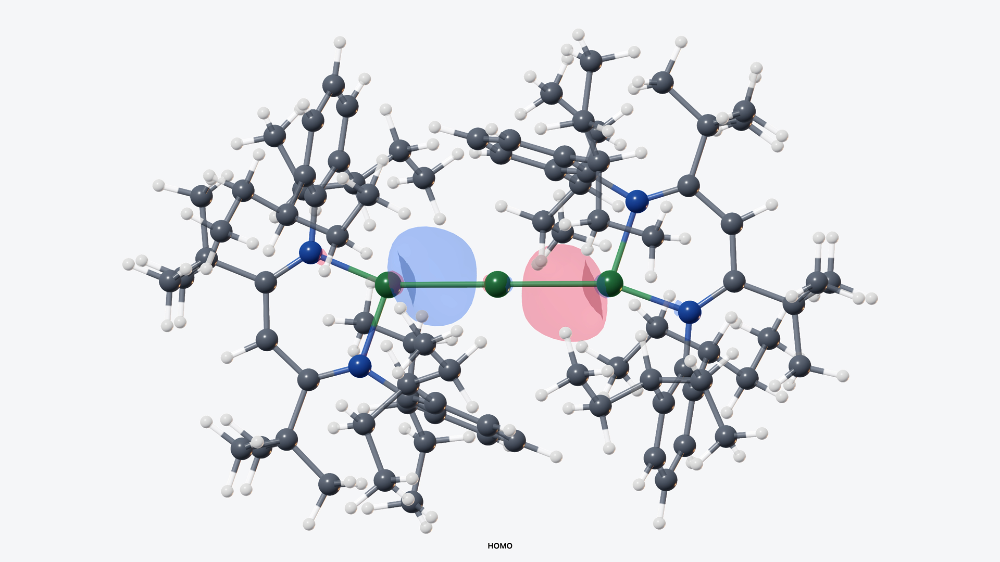

# CrystalScopeX 0.3.3

[English](README.md) | **Deutsch**

  

  <strong><a href="https://github.com/DrWXB/CrystalScopeX-Releases/releases/download/v0.3.3/CrystalScopeX-0.3.3-macOS-arm64.dmg">CrystalScopeX 0.3.3 für macOS arm64 herunterladen</a></strong>

CrystalScopeX ist eine native wissenschaftliche Arbeitsumgebung für
Kristallstrukturen und molekulare Daten. Vollständige kristallographische
Modelle—einschließlich Ionen, Lösungsmittelmolekülen, symmetrieerzeugten
Komponenten, Fehlordnung und anisotropen Auslenkungsparametern—werden
dargestellt, ohne die Quelldatei zu verändern. Interaktive 3D-Inspektion,
Messungen, Strukturbearbeitung, Verfeinerungsanweisungen und
publikationsorientierte Ausgabe sind in einer klaren Oberfläche verbunden.

### Highlights

- **Originalgetreue Strukturdarstellung:** CIF-, INS/RES-, XYZ-, MOL/SDF-,
  PDB/mmCIF- und Gaussian-Cube-Arbeitsabläufe mit Elementarzellen,
  Kristallpackung,
  Symmetrie, Fehlordnung und thermischen Ellipsoiden.
- **Direkte Analyse:** Atominspektion, Beschriftungen, Abstände, Winkel,
  Diederwinkel, Ebenen und Strukturvergleich bleiben mit der Molekülansicht
  verbunden.
- **Wissenschaftliche Ausgabe:** thermische Ellipsoiddiagramme,
  hochauflösender TIFF/PNG-Export sowie Werkzeuge für Orbitalbilder und -videos.
- **Lokale Arbeitsabläufe:** Quellstrukturen bleiben schreibgeschützt;
  optionale ORCA- und SHELXL-Installationen werden vom Benutzer bereitgestellt
  und gesteuert.

Version **0.3.3 (Build 6)** ist für arm64-Systeme mit macOS 26.0 oder neuer und
Metal-Unterstützung vorgesehen.

## Installation

Laden Sie das DMG aus dem [Release v0.3.3](https://github.com/DrWXB/CrystalScopeX-Releases/releases/tag/v0.3.3)
herunter und prüfen Sie die [SHA-256-Prüfsumme](SHA256SUMS.txt).

Dieser Build ist ad hoc codesigniert, aber **weder mit einer Developer ID
signiert noch notarisiert**. Folgen Sie der
[Installationsanleitung](INSTALLATION.md) für das übliche Verfahren
**Datenschutz & Sicherheit → Dennoch öffnen**. Deaktivieren Sie Gatekeeper
nicht systemweit.

## Mg0-Orbitalsequenz

**[Mg0-Video in 4K mit 120 Bildern pro Sekunde ansehen oder herunterladen](https://github.com/DrWXB/CrystalScopeX-Releases/releases/download/v0.3.2/CrystalScopeX-0.3.2-Mg0-orbital-sequence-4K120.mp4)**

## Entwicklerprotokoll — 0.3.3

- Fehler behoben, die Kernfunktionen beeinträchtigten.
- Funktionsleiste und Menüs neu gestaltet.
- Anwendungsleistung verbessert.

## Release-Informationen

- [Änderungsprotokoll](CHANGELOG.md)
- [Installationsanleitung](INSTALLATION.md)
- [Hinweise zu Drittanbietern](THIRD-PARTY-NOTICES.md)
- [Lizenz](LICENSE.md)

ORCA und SHELXL sind optionale, separat lizenzierte und vom Benutzer
bereitgestellte Programme. Sie sind nicht in CrystalScopeX enthalten. Dieses
öffentliche Repository enthält ausschließlich Release-Materialien; privater
Quellcode, Forschungsdaten und lokale Entwicklungspfade werden nicht
veröffentlicht.
