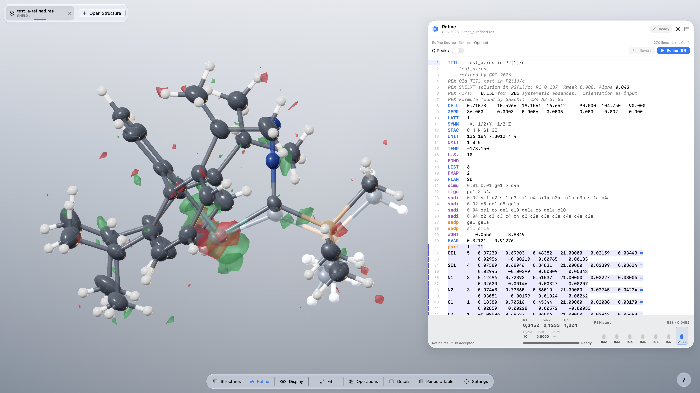

# CrystalScopeX 0.3.6

**English** | [Deutsch](README.de.md)

  

  <strong><a href="https://github.com/DrWXB/CrystalScopeX-Releases/releases/download/v0.3.6/CrystalScopeX-0.3.6-macOS-arm64.dmg">Download CrystalScopeX 0.3.6 for macOS arm64</a></strong>

CrystalScopeX brings crystal structures to life in a fluid, visually rich
scientific workspace. Explore complete crystallo&shy;graphic models in
inter&shy;active 3D, from small molecules to symmetry-generated components,
disorder, twinning, and aniso&shy;tropic displacement para&shy;meters. Then
measure, edit, refine, and shape publication-ready results within one focused
interface designed to keep ideas moving.

## Installation

Version **0.3.6 (build 9)** targets arm64 systems running macOS 26.0 or later with Metal support.

Download the DMG from the [v0.3.6 release](https://github.com/DrWXB/CrystalScopeX-Releases/releases/tag/v0.3.6) and verify its [SHA-256 checksum](SHA256SUMS.txt).

This build is ad-hoc code-signed, but it is **not Developer ID-signed or notarized**. Follow the [installation guide](INSTALLATION.md) for the standard **Privacy & Security → Open Anyway** procedure. Do not disable Gatekeeper globally.

## Demo

## Developer log 0.3.6

- Added an all-new native arm64 crystal-refinement workflow. Compa&shy;tibility with SHELXL1 semantics and instruc&shy;tions is under active develop&shy;ment; the feature remains in beta. The current beta has passed compi&shy;lation tests across more than 5,000 crystallo&shy;graphic cases.

## Release information

- [Changelog](CHANGELOG.md)
- [Installation guide](INSTALLATION.md)
- [Third-party notices](THIRD-PARTY-NOTICES.md)
- [License](LICENSE.md)

ORCA2,3 and SHELXL are optional, separately licensed, user-supplied programs. They are not included in CrystalScopeX. This public reposi&shy;tory contains release materials only; private source code, research data, and local develop&shy;ment paths are not published.

## References

1. Sheldrick, G. M. A short history of *SHELX*. *Acta Crystallogr. A* **2008**, *64*, 112–122. DOI: [10.1107/S0108767307043930](https://doi.org/10.1107/S0108767307043930).
2. Neese, F. The ORCA program system. *WIREs Comput. Mol. Sci.* **2012**, *2*, 73–78. DOI: [10.1002/wcms.81](https://doi.org/10.1002/wcms.81).
3. Neese, F. Software update: The ORCA program system, version 6.0. *WIREs Comput. Mol. Sci.* **2025**, *15* (2), e70019. DOI: [10.1002/wcms.70019](https://doi.org/10.1002/wcms.70019).
