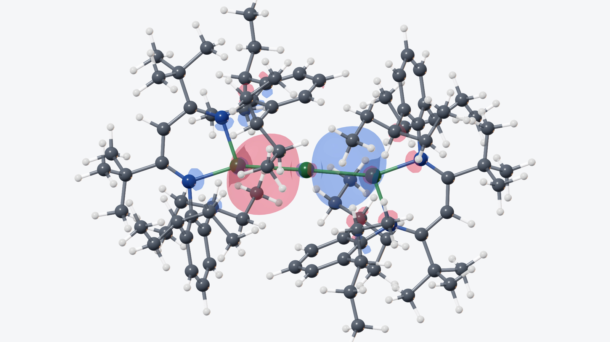

# CrystalScopeX 0.3.2

**English** | [Deutsch](README.de.md)

  

  <strong><a href="https://github.com/DrWXB/CrystalScopeX-Releases/releases/download/v0.3.2/CrystalScopeX-0.3.2-macOS-arm64.dmg">Download CrystalScopeX 0.3.2 for Apple silicon (.dmg)</a></strong>

CrystalScopeX is a native macOS workspace for exploring crystal structures,
molecules, refinement instructions, trajectories, and volumetric calculation
data on Apple silicon.

Version **0.3.2 (build 5)** is the stable public release of the 0.3 generation.
It combines the molecular viewer with a 3D editor, structure comparison,
measurement planes, an integrated SHELXL instruction workspace, optional local
calculation tools, and publication-ready orbital media export.

## Download and get started

Download
**[CrystalScopeX 0.3.2 for Apple silicon](https://github.com/DrWXB/CrystalScopeX-Releases/releases/download/v0.3.2/CrystalScopeX-0.3.2-macOS-arm64.dmg)**
from the `v0.3.2` release. Before opening the disk image, compare it with the
published [SHA-256 checksums](SHA256SUMS.txt).

You will need:

- Apple silicon Mac
- macOS 26.0 or later
- Metal-capable GPU

## A quick note before the first launch

CrystalScopeX 0.3.2 is ad-hoc code-signed, but it is **not signed with an Apple
Developer ID and is not notarized by Apple**. Because of this, macOS is
expected to block the first ordinary launch.

If your download came from this repository and its SHA-256 checksum matches,
the [installation guide](INSTALLATION.md) walks you through the standard
**Privacy & Security → Open Anyway** procedure step by step.

There is no need to disable Gatekeeper globally or run Terminal commands from
third-party sites.

## 0.3.2 showcases in 4K at 120 fps

### Demo1 gold-standard turntable

**[Watch or download the Demo1 gold-standard 4K/120-fps MP4](https://github.com/DrWXB/CrystalScopeX-Releases/releases/download/v0.3.2/CrystalScopeX-0.3.2-Demo1-gold-standard-4K120.mp4)**

This is the protected, unrecompressed Demo1 reference: a clean horizontal
HEVC turntable at 3840 × 2160 and 120 fps, with the accepted 4.8-second gentle
start, faster middle passage, and gentle stop.

### Mg0 frontier-orbital sequence

**[Watch or download the Mg0 orbital-sequence 4K/120-fps MP4](https://github.com/DrWXB/CrystalScopeX-Releases/releases/download/v0.3.2/CrystalScopeX-0.3.2-Mg0-orbital-sequence-4K120.mp4)**

The 24-second HEVC presentation keeps one fixed scientific view and advances
from HOMO−5 through HOMO, then LUMO through LUMO+5, with exactly two seconds
for each calculated orbital.

## Retained 4K preview from the 0.2.2 release

**[Watch or download the original 0.2.2 4K development-preview MP4](https://github.com/DrWXB/CrystalScopeX-Releases/releases/download/v0.2.2/CrystalScopeX-0.2.2-demo-4K.mp4)**

This historically published preview is retained without recompression or
resolution reduction in its original 3840 × 2160 HEVC form. It remains the
accepted visual reference from the 0.2.2 release and remains available beside
the owner-approved 0.3.2 showcase media above.

## 0.3.2 change summary

- **Structure comparison:** automatically align two compatible structures, or
  guide the match with corresponding atoms when a manual scientific choice is
  more appropriate. Compared structures remain visually distinct.
- **Scientific measurements:** measure distances, angles, and dihedrals, or
  define a plane from three or more atoms and use that plane in later
  measurements.
- **Integrated 3D editing:** create and adjust a separate molecular draft while
  the opened source structure remains unchanged.
- **SHELXL instruction workspace:** inspect and edit INS/RES instructions with
  structural spacing, line numbers, syntax styling, PART visibility controls,
  and an optional refine action using a SHELXL executable supplied by the user.
- **Orbital presentation:** import compatible Gaussian Cube folders, browse
  frontier orbitals in scientific order, choose spin channels when present,
  enter one shared isovalue, tune surface opacity, preview rotation, save every
  orbital as a 4K PNG, and export clean HEVC orbital videos at 4K and 120 fps.
- **Clearer depth and camera behavior:** Depth Fade, improved molecular
  lighting, Carl-aware fitting, a stable rotation pivot, and camera-preserving
  orbital switching improve spatial reading without changing the established
  gestures.
- **Focused display controls:** hide hydrogens globally while retaining a
  contextual way to reveal all atoms adjacent to a selected non-hydrogen atom.
- **Restored workspace state:** the app remembers useful window, inspector,
  placement, and molecular-view settings between launches.

See the [detailed changelog](CHANGELOG.md) for the complete public 0.3.2
feature, rendering, performance, compatibility, and safety record.

## Core capabilities retained from 0.2.2

- Native, GPU-accelerated molecular and crystal visualization.
- Ball-and-stick, space-filling, and wireframe representations.
- Unit cells, symmetry, occupancy, disorder, labels, and thermal ellipsoids.
- XYZ and Extended XYZ trajectory playback.
- Distance, angle, and dihedral measurements, now extended by plane tools.
- Read-only Gaussian Cube import with positive and negative orbital
  isosurfaces.
- High-resolution scientific PNG export, including transparent backgrounds
  where supported.
- Keyboard navigation, VoiceOver support, Larger Text, and Reduce Motion.
- Local-first operation without telemetry, advertising, analytics, or a cloud
  account.

## Common file formats

CrystalScopeX concentrates its primary interface on common scientific formats.
The table below is a practical overview rather than a promise that every
possible dialect or extension is interchangeable.

| Format | Stable 0.3.2 support |
| --- | --- |
| CIF | CIF 1.1 and common CIF 2.0 syntax, cells, symmetry, occupancy, disorder, anisotropic displacement data, and periodic geometry |
| XYZ / Extended XYZ | Single structures and trajectories, with common lattice, property, force, velocity, charge, and magnetic-moment fields |
| MDL MOL / SDF | V2000 and V3000 coordinates, bond orders, charges, identifiers, and bounded SDF records |
| PDB / PDBx-mmCIF | Molecular models, common connectivity, multiple models, cells, and supported anisotropic records |
| SHELXL INS / RES | Structural interpretation plus the integrated instruction workspace; source files are never overwritten by opening them |
| Gaussian Cube | Read-only scalar-field and molecular-orbital assets with positive and negative isosurfaces |

## Your files stay yours

- Opening a structure never overwrites its source file.
- File integrity is checked before and after opening.
- Recent files use security-scoped, read-only macOS bookmarks.
- Editing, refinement results, calculation data, images, and videos are written
  as separate outputs only after an explicit user action.
- Scientific images and videos use visible, content-identified structure
  folders under `Documents/CrystalScopeX Exports` by default.
- Exported scientific media does not embed local paths, account identifiers, or
  source-file locations in its presentation layer.
- CrystalScopeX contains no telemetry, advertising, analytics, or cloud-account
  requirement.

## Optional local scientific engines

CrystalScopeX can use compatible ORCA and SHELXL executables that you obtain,
license, install, and select locally. ORCA is not included. SHELXL is not
included. CrystalScopeX does not download, install, copy, sublicense, or
redistribute either program.

CrystalScopeX is an independent third-party application. It is not developed,
endorsed, sponsored, or supported by the ORCA or SHELXL developers or their
affiliated institutions. See [ORCA-NOTICE.md](ORCA-NOTICE.md) for the ORCA
boundary and citations.

To use either optional workflow, obtain the program independently from its
official source, accept its license, and select the local executable from
within CrystalScopeX. A CrystalScopeX download or license grants no right to
third-party software.

## Release information

- [Installation guide](INSTALLATION.md)
- [Detailed changelog](CHANGELOG.md)
- [SHA-256 checksums](SHA256SUMS.txt)
- [ORCA notice](ORCA-NOTICE.md)
- [Third-party interoperability notices](THIRD-PARTY-NOTICES.md)
- [Academic-use license](LICENSE.md)

If you find CrystalScopeX useful in your research, please cite the
[CrystalScopeX GitHub repository](https://github.com/DrWXB/CrystalScopeX-Releases).

This repository is intentionally limited to release binaries, checksums, and
end-user documentation. CrystalScopeX source code and private development
history are not published here; tests and development tools are also kept
separately.

## License

CrystalScopeX 0.3.2 is distributed under the
[CrystalScopeX Academic Use License 1.0](LICENSE.md):

- Non-commercial academic research, teaching, and education are permitted
  without a license fee.
- Commercial use requires a separate written commercial license.
- Modification, reverse engineering, and redistribution are not permitted
  without prior written permission, except where applicable law does not allow
  such a restriction.

This is proprietary academic-use software, not open-source software. The
license grants no rights to ORCA, SHELXL, or other third-party software or
materials.

## Competing interests

The developer declares no competing financial interest.

## Scientific provenance

The structural model visualized in the retained 0.2.2 MP4 was derived from the
crystal structure reported by Rösch et al.1 The molecular orbitals
shown in that video were calculated through the CrystalScopeX local
calculation workflow and rendered by CrystalScopeX; the orbital data were not
taken from the cited publication.

- **DOI:** [10.1038/s41586-021-03401-w](https://doi.org/10.1038/s41586-021-03401-w)
- **Article link:** [Strongly reducing magnesium(0) complexes](https://www.nature.com/articles/s41586-021-03401-w)

**References**

1. Rösch, B.; Gentner, T. X.; Eyselein, J.; Langer, J.; Elsen, H.; Harder, S.
   Strongly Reducing Magnesium(0) Complexes. *Nature* **2021**, *592*, 717–721.
   DOI: [10.1038/s41586-021-03401-w](https://doi.org/10.1038/s41586-021-03401-w).
2. Neese, F. The ORCA Program System. *WIREs Comput. Mol. Sci.* **2012**, *2*,
   73–78. DOI: [10.1002/wcms.81](https://doi.org/10.1002/wcms.81).
3. Neese, F. Software Update: The ORCA Program System—Version 6.0.
   *WIREs Comput. Mol. Sci.* **2025**, *15* (2), e70019. DOI:
   [10.1002/wcms.70019](https://doi.org/10.1002/wcms.70019).
